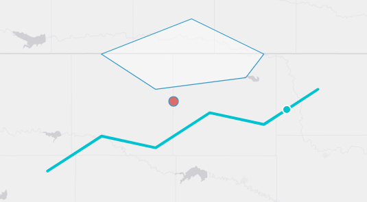

.. _layer_tab:

---------
Layer Tab
---------

The layer tab is used to configure the overall layer, including its name and properties. These properties are based on the `OpenLayers Layer class <https://openlayers.org/en/latest/apidoc/module-ol_layer_Layer-Layer.html>`_.

**Name:** The name of the map layer. This appears in the layer control menu and summary table.

**Default Visibility:** Choose whether the layer is visible by default when the map loads.

**Layer Properties:**
    - **Opacity:** Transparency of the layer (0 to 1).
    - **minResolution:** Minimum resolution (inclusive) for layer visibility.
    - **maxResolution:** Maximum resolution (exclusive) for layer visibility.
    - **minZoom:** Minimum zoom level (exclusive) for layer visibility.
    - **maxZoom:** Maximum zoom level (inclusive) for layer visibility.
    - **minZoomQuery:** Minimum zoom level (inclusive) at which the layer can be queried. If the map is clicked beyond this zoom, it will zoom in to minZoomQuery.
    - **clickTolerance:** Pixel tolerance for clicking (and hovering) features. For ``ESRI Image and Map Service`` layers this is the server identify tolerance (default ``10``). For ``GeoJSON``, ``ESRI Feature Service`` and ``Shapefile`` layers it widens the on-screen hit area for clicks and hover popups (default ``0`` — exact hit). When **snapToFeatures** is enabled, this value also sets the snap radius (default ``15``). See `Feature Snapping and Click Tolerance`_ below.
    - **snapToFeatures:** Snap the cursor to the nearest feature of this layer while hovering, and select that feature on click. Supported for ``ESRI Image and Map Service``, ``GeoJSON``, ``ESRI Feature Service`` and ``Shapefile`` sources. See `Feature Snapping and Click Tolerance`_ below.
    - **snapSublayer:** For ``ESRI Image and Map Service`` snap layers only — the MapServer sublayer used to load snapping features. Defaults to the first id in the source's ``LAYERS`` ``show:N`` parameter, or ``0``. Set it explicitly when the sublayer you want to snap to differs from that default.
    - **renderAsImage:** Draw the whole layer to an intermediate canvas and re-use that image while panning, instead of redrawing every feature on every frame. Much smoother on layers with many features, at the cost of some precision. See `Render As Image`_ below.
    - **imageRatio:** Used only when **renderAsImage** is on — the size of that intermediate canvas relative to the viewport (default ``1``). About ``1.5`` keeps the edges of the map clean while panning, at the cost of drawing more than is on screen. Changing it rebuilds the layer, because OpenLayers only accepts the value when the layer is created.

**Layer Template:** At the bottom of all tabs, you can choose a layer template. This loads a preconfigured layer. Use the dropdown menu to select from available options.

.. _feature_snapping:

Feature Snapping and Click Tolerance
^^^^^^^^^^^^^^^^^^^^^^^^^^^^^^^^^^^^

Clicking exactly on a thin line or a small point is hard — especially on dense datasets like river networks. Two layer properties make features easier to interact with:

**Click Tolerance** simply widens the clickable (and hoverable) area around every feature by the given number of screen pixels. It is the one setting that governs *all* pointer interaction with a layer: feature clicks, hover popups, and (when snapping is enabled) the snap radius.

**Snap To Features** goes further: as the cursor approaches a feature, a highlighted preview traces the feature with a dot marking the exact snapped point, the cursor changes to a pointer, and a click selects that feature directly — no precise aim required. When several features run close together (for example, rivers meeting at a confluence), a click gathers all of the nearby features so the popup can page between them.

|

How snapping behaves:

- **Where the features come from.** ``GeoJSON``, ``ESRI Feature Service`` and ``Shapefile`` layers snap against the features already rendered in the browser — what you see is exactly what you can snap to, with no extra network requests. ``ESRI Image and Map Service`` layers load their features for the current view from the service's ``/query`` endpoint after each pan or zoom (respecting any ``LAYERDEFS`` filter, and the sublayer chosen by **snapSublayer**).
- **Snapping follows visibility.** A layer only snaps while it is actually drawn: turning the layer off in the layer control, or moving outside its **minZoom** / **maxZoom** / **minResolution** / **maxResolution** bounds, disables snapping immediately.
- **minZoomQuery applies.** Like popup queries, snapping is inactive below the layer's **minZoomQuery** zoom level.
- **Radius.** The hover snap radius is **clickTolerance** when set, otherwise ``15`` pixels. The confluence gather radius is at least ``35`` pixels and never narrower than the snap radius.
- **Very large services.** If an ``ESRI Image and Map Service`` snap query is truncated by the server (its ``maxRecordCount``), snapping quietly turns off for that view — clicks fall back to the normal identify behavior — and resumes when you zoom in. A single console warning notes the affected service.
- **Polygons** snap to their boundary, not their interior. Regular clicks inside a polygon still work as usual.

**Example** — a GEOGLOWS river layer that is easy to click:

- **Name:** ``Flowlines``
- **Min Zoom Query:** ``12``
- **Click Tolerance:** ``20``
- **Snap To Features:** checked

Zoomed past level 12, hovering within 20 pixels of a river highlights the nearest reach and a click selects it (updating any connected variable inputs) — even when the cursor is not exactly on the line.

.. _render_as_image:

Render As Image
^^^^^^^^^^^^^^^

A vector layer normally issues one drawing call per feature on every rendered frame. That is fine for hundreds of features and visibly choppy for tens of thousands: panning a layer of ~25,000 points spends most of each frame on drawing calls alone.

**Render As Image** switches the layer to OpenLayers' ``VectorImageLayer``, which draws the features once to an off-screen canvas and re-uses that image while the map is panned — one drawing call per frame instead of one per feature. On a large point layer the difference between choppy and smooth panning.

It is off by default, and deliberately per-layer, because it trades away two things:

- **Features blur slightly while zooming**, until the map settles and the image is redrawn.
- **Hit detection becomes approximate.** Clicks and hover resolve less precisely than the exact hit TethysDash otherwise uses. A popup that opens on a *neighbouring* feature is the expected cost; a popup that does not open at all is not.

Turn it on for layers with enough features to be slow, and leave it off for layers whose features are clicked precisely.

**Which layers it applies to.** Layers that draw individual features in the browser: ``GeoJSON``, ``Shapefile``, ``KML``, ``ESRI Feature Service``, ``GeoPackage``, ``GeoParquet``, and plugin-backed **Custom Layers**. Ticking it on a raster, tile or vector-tile layer has no effect — those layers do not draw features one at a time, so the setting is ignored rather than producing a layer that cannot draw its source.

The layer repaints as soon as the setting is saved; no dashboard save or page reload is needed.
